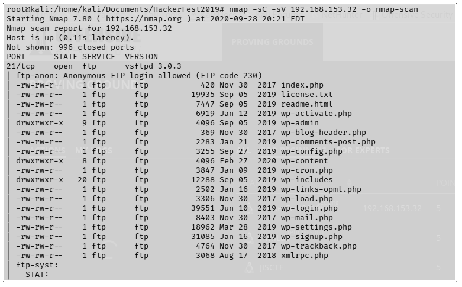

# HackerFest2019 - Walkthrough

`nmap -sC -sV 192.168.153.32 -o nmap-scan`

**Escaneo de Puertos**

Dentro de los archivos que existen dentro de FTP esta wp-config.php

**Extraccion de archivo de configuracion de wordpress**

**Revision del contenido de wp-config.php**

No se puede acceder con estas credenciales ni via SSH ni en wp-admin. Otro vector de ataque seria utilizando un exploit para webmin

**Exploits sugeridos para Webmin**

**Configuracion en Rapid7**

Se ingresa a metasploit los datos que se solicitan para el exploit.

+ RHOST 192.168.153.32
+ LHOST 192.168.49.153
+ LPORT 443
+ exploit target 0 
+ SSL true
+ forceexploit true

**Exploit**

**Flag{92bf511a#######################}**  proof.txt
**Flag{d1d8bcfa########################}** local.txt

## Referencias

+ **Pasos para ejecutar el exploit** https://www.rapid7.com/db/modules/exploit/linux/http/webmin_backdoor
+ **Exploit Webmin 1.920 -Remote Code Execution** https://www.exploit-db.com/exploits/47293
